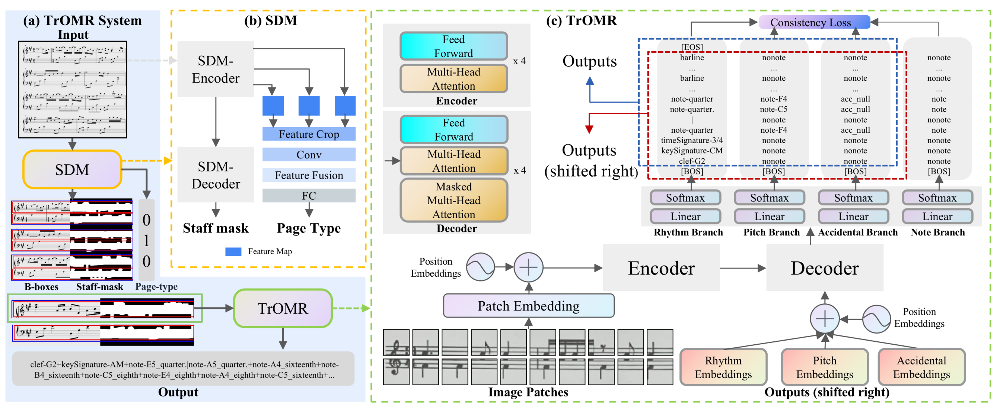
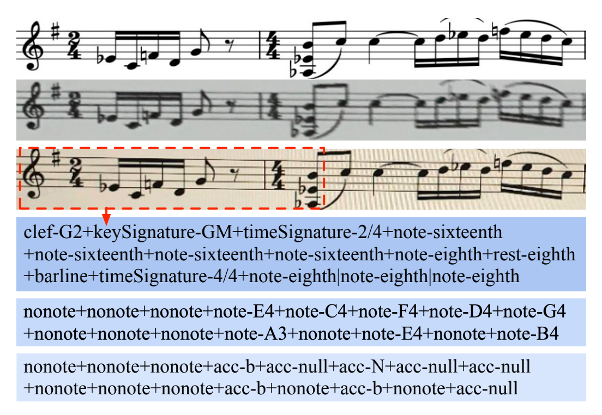
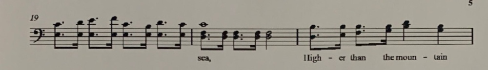
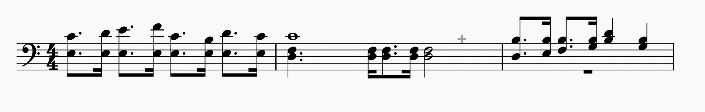
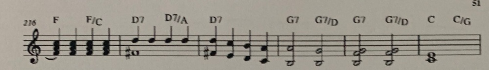
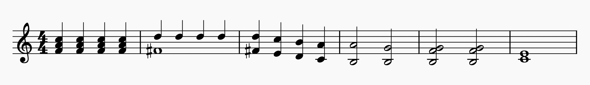
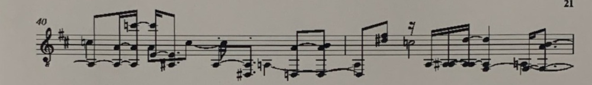
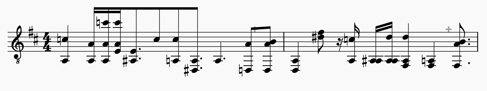
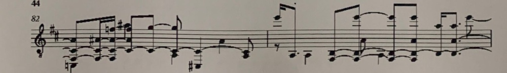
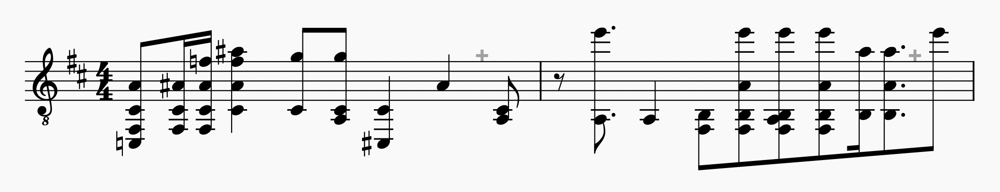

# TROMR:TRANSFORMER-BASED POLYPHONIC OPTICAL MUSIC RECOGNITION
## 📝 Table of Contents

This code was used in the experiments from the paper: "TROMR:TRANSFORMER-BASED POLYPHONIC OPTICAL MUSIC RECOGNITION"
The training code will be open source later.

Introduction
- [Introduction](#Introduction)
- [Dataset](#Dataset)
- [Experiment](#Experiment)
- [Preparation](#Preparation)
- [Inference](#Inference)
- [Demonstrations](#Demonstrations)


## Introduction <a name = "Introduction"></a>

Optical score recognition (OMR) provides an intelligent and efficient way for paper score digitalization, which can be widely used in the field of assisting music teaching, music search, music secondary creation, and so on. we propose a transformer-based approach with excellent global perceptual capability for end-to-end polyphonic OMR, called TrOMR.  Extensive experiments demonstrate that TrOMR outperforms current OMR methods, especially in real-world scenarios.

<div align="center">
  <a href="" rel="noopener">
 </a>
</div>

## Dataset <a name = "Dataset"></a>

The images in MSD are electronic sheet music with clear symbols. The images in CMSD-P are printed and photographed and the symbols are rather blurred and the lines are jagged. The images in CMSD-S, taken on a screen, are slightly blurred and have a lot of moiré. Meanwhile, the effects of light and jitter are also simulated. These operations make our data very close to the real application scenarios.

<div align="center">
  <a href="" rel="noopener">
 </a>
</div>

## Experiment <a name = "Experiment"></a>

To facilitate direct comparison, the results of the model were visualized and the error was marked in the red box. It can be seen that TrOMR has higher recognition accuracy than baseline in areas with dense symbols and in areas further away from the staff.

<div align="center">
  <a href="" rel="noopener">
 </a>
</div>

## Preparation <a name = "Preparation"></a>
```shell
  pip install -r requirements.txt
```

## Inference <a name = "Inference"></a>
```shell
  python ./tromr/inference.py ./examples/photo4.jpg
```
## Demonstrations <a name = "Demonstrations"></a>

The following contents are displayed in the order of input, output visualization and predictive coding:

<div align="center">
 <font face="微软雅黑" size = "70"><h3>Result1</h3></font>
</div>
<div align="center">
  <a href="" rel="noopener">
 </a>
 </a>
</div>
<div align="center">
<table><tr><td >clef-F4+keySignature-CM+note-E3_eighth.|note-C4_eighth.+note-E3_sixteenth|note-D4_sixteenth+note-E3_eighth.|note-E4_eighth.+note-E3_sixteenth|note-F4_sixteenth+note-E3_eighth.|note-C4_eighth.+note-E3_sixteenth|note-B3_sixteenth+note-E3_eighth.|note-D4_eighth.+note-E3_sixteenth|note-C4_sixteenth+barline+note-D3_eighth.|note-F3_eighth.|note-C4_whole+note-D3_sixteenth|note-F3_sixteenth+note-D3_eighth.|note-F3_eighth.+note-D3_sixteenth|note-F3_sixteenth+note-D3_half|note-F3_half+barline+note-D3_eighth.|note-B3_eighth.+note-E3_sixteenth|note-B3_sixteenth+note-F3_eighth.|note-B3_eighth.+note-G3_sixteenth|note-B3_sixteenth+note-B3_quarter|note-D4_quarter+note-G3_quarter|note-B3_quarter+barline</td></tr></table>​​​​​​​
</div>

<div align="center">
 <font face="微软雅黑" size = "70"><h3>Result2</h3></font>
</div>
<div align="center">
  <a href="" rel="noopener">
 </a>
 </a>
</div>
<div align="center">
<table><tr><td >clef-G2+keySignature-CM+note-F4_quarter|note-A4_quarter|note-C5_quarter+note-F4_quarter|note-A4_quarter|note-C5_quarter+note-F4_quarter|note-A4_quarter|note-C5_quarter+note-F4_quarter|note-A4_quarter|note-C5_quarter+barline+note-F4#_whole|note-D5_quarter+note-D5_quarter+note-D5_quarter+note-D5_quarter+barline+note-F4#_quarter|note-D5_quarter+note-E4_quarter|note-C5_quarter+note-D4_quarter|note-B4_quarter+note-C4_quarter|note-A4_quarter+barline+note-B3_half|note-A4_half+note-B3_half|note-G4_half+barline+note-B3_half|note-F4_half|note-G4_half+note-B3_half|note-F4_half|note-G4_half+barline+note-C4_whole|note-E4_whole+barline</td></tr></table>​​​​​​​
</div>

<div align="center">
 <font face="微软雅黑" size = "70"><h3>Result3</h3></font>
</div>
<div align="center">
  <a href="" rel="noopener">
 </a>
 </a>
</div>
<div align="center">
<table><tr><td >clef-G2+keySignature-DM+note-A2_eighth|note-C4N_quarter+note-A2_sixteenth|note-A3_sixteenth+note-A2_sixteenth|note-A3_sixteenth|note-C5N_sixteenth+note-E3_sixteenth|note-A3_eighth|note-C5_sixteenth+note-A2#_eighth.|note-E3_eighth.+note-C4_eighth+note-A2_sixteenth|note-C4_eighth+note-D2#_eighth.|note-A2_eighth.+note-A2N_quarter.+note-D2N_eighth|note-A3_eighth+note-D2_eighth|note-A3_eighth|note-B3_eighth+barline+note-D2_eighth|note-A2_quarter+note-D4#_eighth|note-F4_eighth+note-C4N_half|rest-sixteenth+note-A2_sixteenth+note-A2_sixteenth|note-A2#_sixteenth+note-A2_sixteenth|note-A2_sixteenth|note-D4_sixteenth+note-F2_quarter|note-A2_quarter|note-D4_quarter+note-F2_sixteenth|note-A2N_quarter+note-F2_eighth.|note-A3_eighth.|note-B3_eighth.+barline</td></tr></table>​​​​​​​
</div>

<div align="center">
 <font face="微软雅黑" size = "70"><h3>Result4</h3></font>
</div>
<div align="center">
  <a href="" rel="noopener">
 </a>
 </a>
</div>
<div align="center">
<table><tr><td >clef-G2+keySignature-DM+note-C2N_quarter|note-F2_eighth|note-C3_eighth|note-A3_eighth+note-F2_sixteenth|note-C3_sixteenth|note-A3#_sixteenth+note-F2_sixteenth|note-C3_sixteenth|note-A3_sixteenth|note-F4N_sixteenth+note-C3_eighth|note-A3_eighth|note-F4_eighth|note-A4#_quarter+note-C3_eighth|note-G4_eighth+note-A2_quarter|note-C3_eighth|note-G4_eighth+note-C2#_quarter|note-C3_quarter+note-A3_quarter+note-A2_eighth|note-C3_eighth+barline+note-E5_sixteenth|rest-eighth+note-A2_eighth.+note-A2_quarter+note-F2_eighth|note-B2_eighth+note-F2_eighth|note-B2_eighth|note-A3_eighth|note-E5_eighth+note-A2_eighth|note-A2_quarter|note-D3_eighth|note-E5_eighth+note-F2_eighth|note-B2_eighth|note-A3_eighth|note-E5_eighth+note-B2_sixteenth|note-A4_sixteenth+note-B2_eighth.|note-A3_eighth.|note-A4_eighth.+note-E5_eighth+barline</td></tr></table>​​​​​​​
</div>


