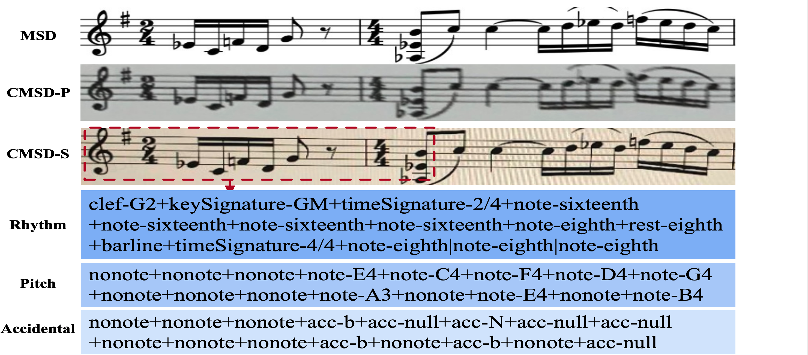

# TROMR:TRANSFORMER-BASED POLYPHONIC OPTICAL MUSIC RECOGNITION
## 📝 Table of Contents
Introduction
- [Introduction](#Introduction)
- [Dataset](#Dataset)
- [Preparation](#Preparation)
- [Inference](#Inference)
- [Results/Demonstrations](#Results/Demonstrations)


## Introduction <a name = "Introduction"></a>

Optical score recognition (OMR) is a kind of paper music digitalization technology which has been developed in recent years. It provides an intelligent and efficient way for music digitalization (midi, musicxml), which can be widely used in the field of assisting music teaching, music search, music secondary creation and so on. This sharing will introduce the technical principles of music score recognition technology and cloud music's exploration and practice achievements in music score recognition. we propose a transformer-based approach with excellent global perceptual capability for endto-end polyphonic OMR, called TrOMR.  Extensive experiments demonstrate that TrOMR outperforms current OMR methods, especially in real-world scenarios.


## Dataset <a name = "Dataset"></a>
 
<p align="center">
  <a href="" rel="noopener">
 </a>
</p>

## Methodology <a name = "methodology"></a>

### 1. Noise Filtering and Binarization
<p align="center">
  <a href="" rel="noopener">
 </a>
</p>

### 2. Segmentation

<p align="center">
  <a href="" rel="noopener">
  </a><br> <br> 
  </a><br> <br> 
  </a>
</p>


### 3. Staff Line Detection and Removal

<p align="center">
  <a href="" rel="noopener">
  </a><br> <br> 
  </a><br> <br> 
  </a>
</p>

### 4. Construct The New Staff Lines

<p align="center">
  <a href="" rel="noopener">
  </a><br> <br> 
  </a><br> <br> 
  </a>
</p>


### 5. Symbol Detection and Recognition

<p align="center">
  <a href="" rel="noopener">
  </a><br> <br> 
  </a><br> <br> 
  </a>
</p>


## 🏁 Install <a name = "Install"></a>
1. You can use the attached notebook for quick testing and visualization.
2. You can setup an environment on your local machine to run the project:
    1. Install [Conda](https://docs.conda.io/projects/conda/en/latest/user-guide/install/)
    2. ```conda env create -f requirements.yml```
    3. ```conda activate mozart```
    4. ```python3 main.py <input directory path> <output directory path>```

> You can find the dataset on [Google Drive](https://drive.google.com/drive/u/0/folders/1OVGA3CGnEKjyg_k_L8MP2RO5R3oDIbHE).

> Please check the following [issue](https://github.com/aashrafh/Mozart/issues/8) for another ```requirements.yml``` file. 


## ⛏️ Built Using <a name = "tech"></a>
- [Python 3.8.3](https://www.python.org/)
- [NumPy](https://numpy.org/doc/stable/index.html)
- [OpenCV](https://opencv.org/)
- [scikit-learn](https://scikit-learn.org/stable/)
- [scikit-image](https://scikit-image.org/)
